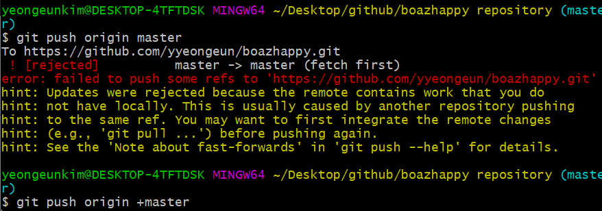

# 7월 8일 1주차 테스트 복기

1.  git이란 무엇인가
    > 분산버전관리시스템으로 다중의 작업자가 효율적으로 작업 관리를 위한 툴
2. staging area의 의미
    > 로컬에서 작업 후 커밋하기 전 임시로 저장되는 공간
3. 작업이 완료 되었을 때, 버전을 기록하는 과정을 명령어로 작성하고, 커밋이 가지는 의미가 무엇인가?
     ```bash 
     $git add <파일>
     $git commit -m "작업내용"
     ```
     > 추적내역에 작업을 추가하고 그 내역을 기록함
    
4. gitignore를 활용하는 이유
    > 프로젝트에서 관리 할 필요 없는 파일들에 대해 추적을 중지시킴

5. 커밋 내역을 확인하는 명령어
    ```bash
    $git log
    ```
6. gitbub외에도 원격저장소는 있는가?
    > [github](github.com), [gitlab](https://about.gitlab.com/), [bitbucket](https://bitbucket.org/)


7. 다음과 같은 상황을 설명하고 해결법은 무엇인가
    
    ```bash
    $git pull origin <브랜치>
    ```
    > 원격 저장소와 로컬저장소의 커밋 내역이 다르기 때문에 발생하는 
    문제이며 pull 명령어를 통해 동기화 시켜준 후 다시 push 한다.

8. 원격저장소를 복제하기 위한 명령어
    ```bash
    $git clone <원격 저장소 URL>
    ```    
9. 복제했을때 저장소의 위치
    > 현재 터미널 위치의 하위 디렉토리에 복사된다.
10. 브랜치를 사용하는 목적
    > 여러 작업자들이 독립적으로 기능 구현을 위해 사용한다.
11. 병합 충돌이 발생했을 때 해야하는 일
    > **<<<<** 충돌 표시된 부분을 수정하고 커밋한다.
