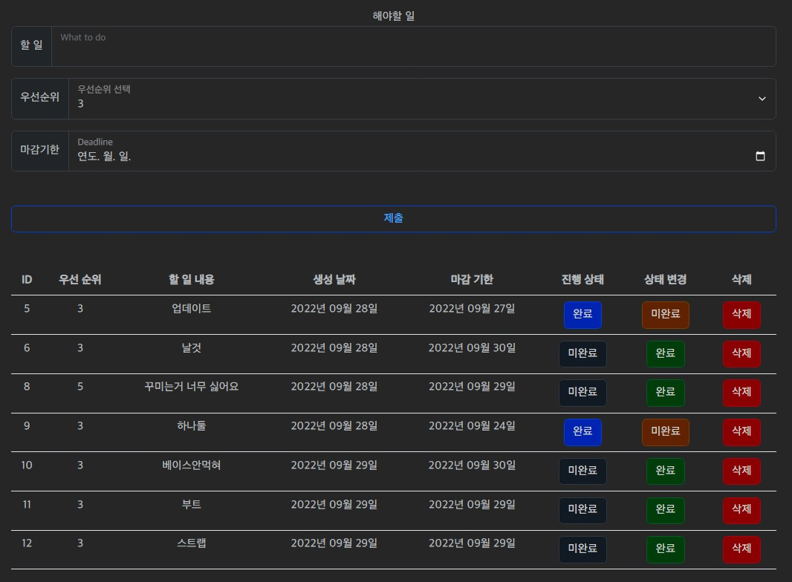

# Todo 리스트 구현

## 완성 모습
--- 

## 기능 구현
- 할 일 추가하기 Create

        1. create() 메소드를 활용합니다.
        2. 아래 데이터를 사용자에게 입력받아서 데이터를 생성합니다.
            - 내용 / 우선 순위 / 마감 기한
        3. 할 일 목록 페이지로 redirect 합니다.
- 할 일 목록 보기 Read

        1. 모든 데이터를 id를 기준으로 오름차순으로 정렬해서 불러옵니다.
        2. 불러온 데이터를 템플릿에서 반복문을 사용해 1개씩 화면에 표시합니다.
- 할 일 완료(completed) 여부(True / False) 변경하기 Update
 
        1. 삭제할 할 일의 id가 필요합니다.
        2. get() 메소드를 사용하여 변경할 데이터를 불러옵니다.
        3. 불러온 데이터의 상태를 변경 후 저장합니다.
        4. 할 일 목록 페이지로 redirect 합니다.
- 할 일 삭제하기 Delete

        1. 삭제할 할 일의 id가 필요합니다.
        2. get() 메소드를 사용하여 변경할 데이터를 불러옵니다.
        3. 불러온 데이터를 삭제합니다.
        4. 할 일 목록 페이지로 redirect 합니다.

## 화면 구현

- 할 일 목록 테이블 table
    - thead
        - 우선 순위 / 할 일 내용 / 생성 날짜 / 마감 기한 / 진행 상태 / 상태 변경 / 삭제 를 테이블 헤더로 사용합니다.
    - tbody
        - id를 기준으로 오름차순으로 정렬한 모든 데이터를 화면에 표시합니다.
    - 변경
        - 버튼을 누르면 해당 할 일의 상태(True / False)가 수정됩니다.
    - 삭제
        - 버튼을 누르면 해당 할 일이 삭제됩니다

## 감상
- 그 놈의 부트스트랩
- 베이스.html이 제대로 적용되지 않아 결국 인덱스.html에서 직접 구현하였음
- github 업로드시 Django 비밀키가 같이 업로드되니 보안에 신경 쓰자